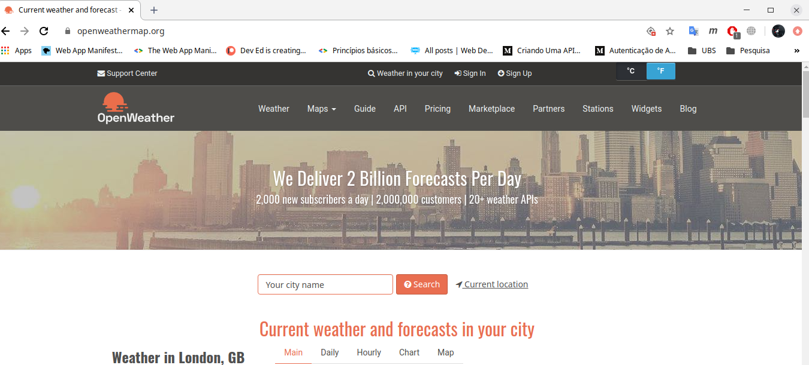
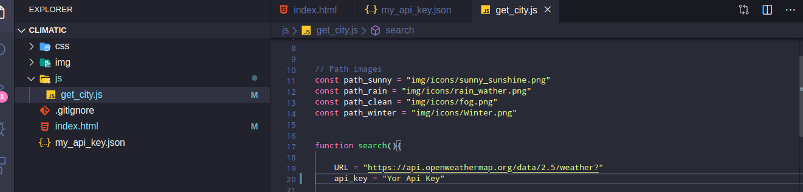
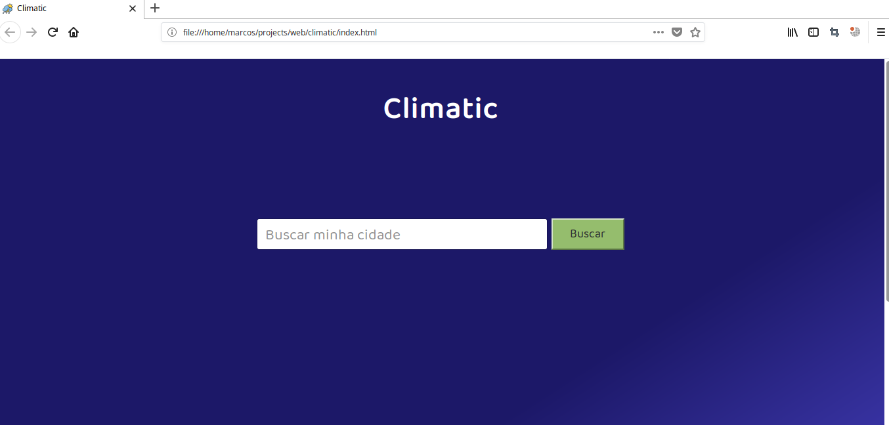
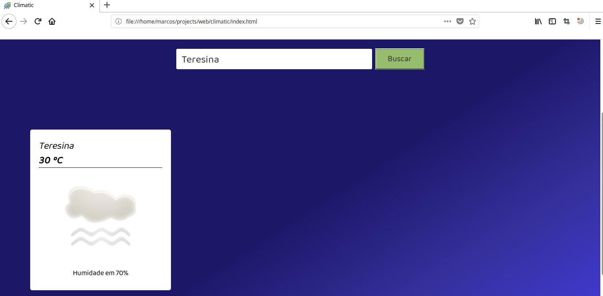
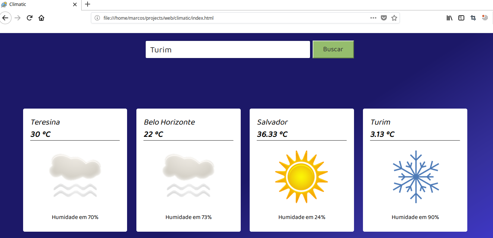
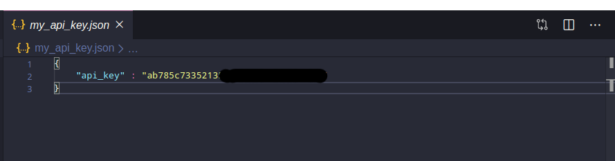

# Climatic
Climatic is a simple web page to consult the climatic conditional of a city.
One or many cities can be consulted.

The aim of the project was to put into practice basic skills in css, html and javascript.

## How to use the Project 
1. First, go to the website <a target="_blank" href="https://openweathermap.org/">openWeatherMap</a>.
The openWeatherMap is a API for get climactics conditionals, it has a lot of features.

2. Create your account on the platform, and then generate an api key for your project

3. Set your api key in  file <strong>get_city.js</strong> 

That done, you can make querys and be happy :)

If you want to find other information the website <a target="_blank" href="https://openweathermap.org/">openWeatherMap</a> have a doc 
detailed with all api routes.

## Images Screens

## Note

Initially, I created a JSON file that contained my api key, and with a script I was able to access it, but this only worked in the firefox browser, google chrome blocked access due to its security rules, since I was trying to access a file in the file : ///

It didn't work, but it would be cool
